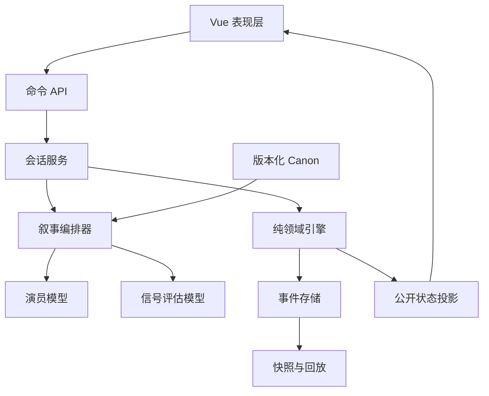

# 天台十句：架构重置方案

> 分支：`refactor/architecture-reset`  
> 目的：把当前 v1 当作可运行的产品原型，重新设计一个能被验证、回放、运营和持续扩展的游戏内核。本文记录的是设计结论，不是对现有代码的局部修补清单。

## 结论先行

当前项目的主要问题不是 Vue 组件太大、Prompt 不够长，也不是还缺一个 Provider。根问题是**系统没有唯一的事实来源**：浏览器保存并修改游戏状态，服务器接受浏览器传来的历史与计数，模型又同时参与内容生成和机制判断；同一套规则再被手写成 Go 常量、TypeScript 常量、Prompt、正则和文档。只要这些副本出现一点差异，玩家看到的剧情、结局、存档和后日谈就可能互相矛盾。

重置后的核心边界只有一句话：

> **模型负责提出内容和带证据的建议，领域引擎负责决定事实；客户端负责呈现事实，不能决定事实。**

这意味着新系统首先是一个可重放的有限状态机，其次才是一个 LLM 应用。LLM 可以替换、降级或暂时不可用，游戏仍然能保持合法状态；同一份事件日志在同一版本的规则下必须得到同一份结算结果。

## 对当前系统的结构性诊断

| 观察到的事实 | 位置 | 底层失败 | 直接后果 |
| --- | --- | --- | --- |
| `/api/chat` 接收 `rounds_left`、`affection`、`turns_used`、`ai_state` 和完整 `history` | `backend/handlers/game.go:22-39` | 请求不是命令，而是客户端提交的“新状态计算材料” | 客户端可以篡改回合、重复历史或伪造结局前置条件；服务端无法判断请求是否来自上一回合 |
| Pinia store 先扣机会、再应用压力和触达、再决定结局 | `legacy_vue/src/store/gameStore.ts:123-175` | 领域规则放在 UI 状态容器里 | 规则只能在浏览器执行，后日谈、其他客户端、服务端任务和回放都没有共同语义 |
| 演员调用后再调用裁判，裁判输出 `ending_type`、`affection_delta` 和 `pressure_delta` | `backend/llm/service.go:832-873` | 概率模型同时承担叙事和规则裁决 | 一次温度为 0.2 的模型回答即可改变核心状态；失败时静默回退，玩家无法知道本回合是否已结算 |
| 后端 `clampTurnEvaluation` 只对模型结果做白名单和数值裁剪 | `backend/llm/service.go:360-420` | “合法枚举”被误当成“合法世界状态” | `end_acquaintance` 只要达到数字门槛就可能被接受，语义证据和物理动作没有成为硬约束 |
| 前端还有 `resolveFallbackEndingType` 与叙事正则 | `legacy_vue/src/domain/gameContract.ts:298-389` | 结局有第二套本地决策引擎 | 模型、后端和前端可以对同一回合给出三种不同解释；正则命中自然语言不是可靠的游戏事实 |
| 结局阈值同时存在于 Go、TypeScript、Prompt 和文档 | `backend/llm/game_contract.go`、`legacy_vue/src/domain/gameContract.ts:275-289` | 契约靠人工同步 | 每次改规则都需要跨语言搜索和测试“它们仍然相等”，扩展内容时风险呈乘法增长 |
| 玩家 API Key、模型和任意 `base_url` 从浏览器发到后端 | `backend/handlers/game.go:34-38`、`legacy_vue/src/modules/LLMService.ts:1-120` | 供应商选择与游戏会话耦合，网络边界没有被定义 | 明文 localStorage、通配 CORS、任意自定义地址、无限成本和 SSRF 风险同时存在 |
| `SaveSystem` 使用 localStorage + Base64 + CRC32 | `legacy_vue/src/modules/SaveSystem.ts:51-68`、`:107-195` | 存档是可被客户端任意改写的 UI 数据 | CRC32 只能发现偶发损坏，不能证明来源；没有版本迁移、服务器备份、回放或跨设备一致性 |
| `GameView.vue` 接近千行，`gameContract.ts` 同时放规则、资产路径、正则推断和视觉解析 | `legacy_vue/src/views/GameView.vue`、`legacy_vue/src/domain/gameContract.ts` | 表现层、领域层和内容目录没有边界 | 任意视觉改动都可能碰到规则；新章节只能继续堆在单体文件里 |
| 代码、文档和分支同时维护 v1、`legacy_vue`、`v2/roadmap` | 根目录与 README | 演进模型不清晰 | 团队无法判断哪个是运行时事实、哪个是实验、哪个可以删掉；重构会继续产生平行实现 |

这些问题是相互放大的：客户端权威让存档不可信，双重规则让错误难以定位，模型参与裁决让回放失去确定性，手工契约又让修复无法一次覆盖所有入口。继续在现有分层上添加功能，只会把耦合推迟到下一次事故。

## 设计哲学

### 1. 先定义事实，再生成表现

事实包括回合是否消耗、当前阶段、触达次数、危险姿态、结局和是否解锁后日谈。事实只能由纯领域引擎从上一状态和命令产生。艾说了什么是叙事内容；“她已经离开栏杆”是领域事实，必须由引擎在满足门槛和证据后写入。

### 2. 概率边界必须可替换、可审计

模型输出不是 `State`，而是 `TurnAssessment`：回复文本、情绪候选、触达候选、压力候选和带证据的叙事信号。引擎会把它当作不可信输入进行白名单、范围、阶段和结局门槛校验。记录原始建议、模型版本、Prompt 版本和归一化结果，才能解释“为什么这一回合这样结算”。

### 3. 内容是版本化数据，不是散落在函数里的字符串

角色事实、空间边界、状态词典、结局语义和 Prompt 模板应放在版本化 Canon 中，由 Prompt 编译器投影成演员、评估器、提示和后日谈上下文。规则代码只依赖稳定 ID，不依赖中文文案或正则猜测。

### 4. 用事件记录变化，用快照加速读取

每次合法命令产生一个不可变事件：`turn.accepted`、`touch.registered`、`pressure.applied`、`ending.resolved`。快照只是事件折叠结果，可丢弃后重建。这样可以支持存档、回放、客服排障、数据分析和规则升级，而不依赖浏览器 localStorage。

### 5. 把安全和成本当成边界条件

产品面对的是脆弱主题，且每句都可能触发两次模型调用。系统必须在入口限制文本长度、请求频率、单局预算和并发；只把必要的脱敏内容写入日志；模型或网络失败时使用明确的安全降级，而不是返回 HTTP 200 再让客户端猜测成功与否。

## 重置后的目标架构



依赖方向必须保持单向：

```text
HTTP / WebSocket -> application -> domain
                       |             |
                       v             v
                 narrative ports   event store
```

`domain` 不导入 Gin、Vue、LLM SDK、数据库或文件系统；`narrative` 只能通过端口返回建议；`application` 负责事务、超时、幂等和权限；适配器负责 HTTP、模型供应商和存储。

## 核心领域模型

### 状态

新内核的 `State` 至少包含：

- `schema_version`、`session_id`、`revision`：用于迁移、并发控制和回放；
- `phase`：`playing`、`ended`、`after_story`；
- `opportunities`、`hints_remaining`、`touches`、`affection`：引擎拥有的资源；
- `ai_state`、`emotion`、`position`：用于表现的投影，不直接由客户端写入；
- `transcript`、`events`、`ending`：叙事记录和可审计结算；
- `processed_commands`：幂等键到结算收据的映射。

`affection` 不再作为独立可编辑字段；它由 `touches * affection_per_touch` 推导并在快照中缓存。任何快照加载都必须通过同一个校验器，拒绝负数、非法阶段、结束却没有结局等状态。

### 命令

客户端只发送命令：

```json
{
  "command_id": "uuid",
  "session_id": "uuid",
  "expected_revision": 6,
  "text": "我听见你说那组照片被叫作漂亮的痛苦了。"
}
```

客户端不能发送历史、好感、机会、姿态、结局、Prompt 或 API Key。服务器从 `session_id + revision` 取出真实上下文，完成一次事务后返回新的公开状态。`expected_revision` 失败时返回 `409 Conflict`，同一个 `command_id` 重试时返回原收据而不重复扣回合。

### 回合生命周期

1. 应用层验证会话、幂等键、版本和输入长度。
2. 引擎预留一个回合并创建 `turn.started`，防止重复提交。
3. 编排器从 Canon 和服务器状态构造有限上下文，调用演员模型得到文本。
4. 评估模型只返回 `TurnAssessment`；JSON schema、枚举和大小限制在适配器层执行。
5. 引擎以旧状态、命令和建议执行纯结算：基础消耗、压力、触达返还、姿态变化和结局门槛全部在这里完成。
6. 追加事件并写入快照；返回 `TurnResult` 和公开投影。
7. 模型失败时记录 `narrative.degraded`，使用安全短回复和零触达建议；状态仍然由引擎合法地推进。

## 结局规则的重写

数字门槛只能是必要条件，不能直接等价于结局。新引擎采用以下关系：

```text
相识 = 数值门槛
     AND 本回合存在 recovery 证据
     AND 本回合存在 contact_exchange 证据
     AND 当前阶段仍为 playing

消失 = 数值门槛
     AND 本回合存在 recovery 证据
     AND 本回合不存在 contact_exchange 证据

死亡 = 机会耗尽且没有合法成功结算
     OR 达到明确定义的严重伤害失败条件
```

模型说“交换了联系方式”不能直接改状态；它只能提交一个 `contact_exchange` 候选，且在数值、阶段和恢复证据都满足时由引擎接受。模型、前端正则和叙事关键词都不再拥有第二个结局决策权。

## API 与存储边界

### API

- `POST /api/v2/sessions`：创建会话，返回 `session_id`、版本和公开状态；
- `GET /api/v2/sessions/{id}`：读取公开状态；
- `POST /api/v2/sessions/{id}/turns`：提交玩家命令，服务端以 `command_id` 幂等；
- `POST /v2/sessions/{id}/hints`：消耗提示并返回提示事件；
- `POST /v2/sessions/{id}/after-story/messages`：只允许相识结局；
- `GET /v2/sessions/{id}/events`：管理员或本地调试模式使用的回放接口。

旧 `/api/chat` 等接口可以在迁移期保留适配器，但它们只能把旧请求转换成命令，不能继续让旧请求体直接进入领域引擎。

### 存储

第一阶段使用 SQLite 实现 `EventStore` 和 `SnapshotStore`，接口保持可替换；多人或正式部署切换 PostgreSQL。浏览器只保存 UI 偏好和最近一次会话 ID。导出存档是服务器签名的事件包，包含 `schema_version` 和 `canon_version`，而不是 Base64 + CRC32。

## 客户端重构

前端不再使用一个 Pinia store 作为领域引擎。建议目录：

```text
legacy_vue/src/
  app/                 # 路由级编排与 query 状态
  api/                 # 只负责 v2 命令和响应
  domain/              # 生成的协议类型 + 只读 view model
  features/game/       # 主线页面、输入、演出协调
  features/after-story/
  features/settings/   # 仅本地偏好
  ui/                  # 无规则的通用组件
```

页面通过 `gameClient.submitTurn(text)` 发送命令，收到 `TurnResult` 后替换 view model。任何“扣机会”“解锁后日谈”“决定结局”的代码都不应出现在 Vue 组件或浏览器存档模块中。

## 迁移顺序

### 阶段 A：建立不变量（当前分支已完成）

- 以 `backend/game` 建立纯 Go 领域引擎和表格测试；
- 用 `contracts/game.v2.json` 固定命令、公开状态和评估建议的边界；
- 将结构性诊断、事件模型和迁移门槛写入本文档；
- 不改变 master 的线上 v1。

### 阶段 B：切断客户端权威（当前分支进行中）

- 已增加 `SessionService`、进程内会话存储、事件回放和 `/api/v2` API；
- 已将服务端模型配置接入 `Narrator` 端口；无 Key 或模型失败时以 `narrative.degraded` 安全降级，仍由领域引擎结算；
- 已覆盖乐观并发、幂等收据、命令载荷冲突、未知 JSON 字段和事件副本隔离；
- 仍需增加持久化 `EventStore`、前端 v2 client adapter 和旧存档的 transcript-only 导入；
- 前端增加 v2 client adapter，先只承载新会话；
- 为旧存档提供一次性导入：只导入 transcript，重新由引擎验证并标记为 `legacy_import`；
- 禁止旧客户端向 v2 发送计数和结局字段。

### 阶段 C：替换 LLM 边界

- 把 `backend/llm/service.go` 拆成 provider adapter、prompt compiler、actor 和 assessor；
- 加入 JSON schema 校验、超时、预算、重试和脱敏日志；
- 将模型建议与最终事件同时落盘，建立固定 transcript fixtures。

### 阶段 D：切换表现层与存储

- 迁移主线页面到 feature 目录，保留现有 CG 与音频作为资源；
- SQLite/PostgreSQL event store 上线；
- 旧 `/api` 和旧 localStorage 仅保留兼容期，完成迁移后删除 `legacy_vue` 命名和本地结局正则。

## 重构完成的验收条件

1. 同一事件日志离线重放 100 次，公开状态、结局和事件序列完全一致。
2. 修改浏览器请求中的机会、好感、历史或结局字段不会改变服务器结算，因为 v2 根本不接受这些字段。
3. 同一 `command_id` 重试不会重复扣机会、触达或生成第二条消息。
4. 评估模型返回非法枚举、超大数值、过早结局或互相矛盾的证据时，状态仍满足不变量。
5. 模型不可用时，游戏能完成合法降级回合，且客户端能明确显示降级状态。
6. 前后端协议由单一 schema 生成或校验，不再用测试读取 TypeScript 源码来证明 Go 常量相等。
7. 日志、导出存档和客服排障不包含 API Key；自定义模型地址经过 allowlist 和 SSRF 防护。

## 暂时不做的事

- 不在第一阶段追求微服务、消息队列或多模型路由；这些不能修复事实来源问题。
- 不把模型换成更大的模型当作架构修复；更强模型仍然是不可信输入。
- 不先重写视觉资产；现有资源可以作为新表现层的输入。
- 不承诺这套虚构机制能预测或处置现实危机；内容安全和现实求助信息必须在产品层单独设计。

这次重构的成功标准不是“文件变多”或“代码更像企业项目”，而是任何一个玩家回合都能回答四个问题：谁提交了命令、引擎依据什么事实结算、模型建议被接受了哪一部分、这次结果能否在未来重放。
