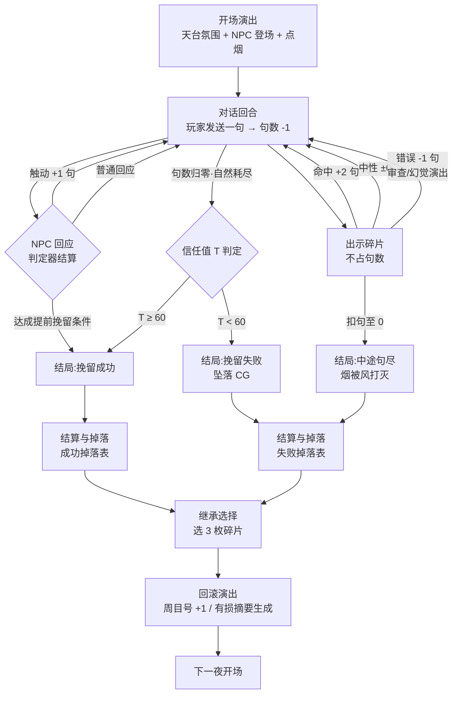

# 02 玩法系统详设（策划 / 程序共用规则书）

> 本册给出《天台十句》v2 全部玩法规则的数值与边界条件。命名、基线数值与 [README](README.md) 一致；世界观与 NPC 设定见 [01 册](01_world_and_narrative.md)；数据结构与 API 落地见 [03 册](03_technical_architecture.md)；判定器与 Prompt 实现见 [04 册](04_prompt_architecture.md)；艾章逐句示例见 [05 册](05_demo_ai_blueprint.md)。
>
> 写作约定：凡标注「**决策**」的条目，是本册在基线未覆盖处做出的明确默认决策，附一句理由；程序按此实现，策划如需推翻须改本册。

---

## 1. 核心循环

### 1.1 一夜流程（微观循环）

一夜的八个阶段，程序按状态机实现（状态枚举见 [03 册](03_technical_architecture.md)）：

| # | 阶段 | 内容 | 时长目标 |
| --- | --- | --- | --- |
| 1 | 开场演出 | 天台环境镜头、NPC 登场动作、最后协议提示「剩余额度：10 句」、烟点燃 | 30–60 秒 |
| 2 | 对话回合 | 玩家输入（单句 ≤ 60 字，超长时输入框截断并提示）→ 扣 1 句 → NPC 流式回应 → 判定器结算 | 主体 |
| 3 | 碎片出示 | 任意回合间可发起，见 [第 3.5 节](#35-出示交互一次出示的完整判定链) | 穿插 |
| 4 | 结局触发 | 提前挽留 / 句尽判定 / 中途句尽，三选一 | 即时 |
| 5 | 结局演出 | 成功：走下栏杆 CG；失败：坠落 CG；句尽：烟灭黑屏 | 30–90 秒 |
| 6 | 掉落展示 | 逐枚展示本夜获得碎片（含首见文案） | 20 秒 |
| 7 | 继承选择 | 背包界面，选出最多 3 枚带入下一周目 | 玩家自控 |
| 8 | 回滚演出 | 雨滴倒放、霓虹闪回、周目号 +1、有损摘要写入回顾页 | 15 秒 |

### 1.2 宏观循环（周目结构）

- **周目号（loop_id）全局递增**：每完成一次「一夜流程」（无论成败）loop_id +1。周目号显示在回滚演出与回顾页，是「你被困了多少夜」的叙事计数。
- **失败即重演**：某夜失败或句尽，下一周目强制重演同一 NPC 之夜。NPC 因重新采样而言行有别（世界观解释：回滚重生成），但情绪锚点、碎片表、私密钥词不变。
- **成功即推进**：某夜成功，解锁链上下一位 NPC；下一周目默认进入新 NPC 之夜。
- **夜路重访**：已成功通关的 NPC 之夜可在「夜路选择」界面重访（用于网状回响：把后面拿到的碎片带回去给前面的 NPC 出示）。重访同样消耗一个周目、走完整一夜流程。**决策**：重访之夜的成败不回退主线进度（已解锁的保持解锁），只影响碎片、成就与隐藏对话——避免玩家为触发隐藏内容而惩罚性倒退。

### 1.3 NPC 解锁顺序与开场传染

链条固定：**艾 → 周伯 → 童 → 夏 → 镜 → 苏晚 → 终章·林默**（哀伤阶段映射见 [01 册](01_world_and_narrative.md)）。

多智能体「情绪传染」规则（Notion 定稿的数值化）：

| 前一夜结果 | 对下一位 NPC 开场的影响 |
| --- | --- |
| 高信任成功（T ≥ 70 结束） | 初始信任 +5；开场自带 1 条「传闻」对话线索（如周伯开口：「昨晚那个抽烟的姑娘，是你劝下来的？」） |
| 低信任成功（60 ≤ T < 70） | 初始信任 +0；传闻线索保留 |
| 首次进入（无前序记录，仅艾章） | 初始 T = 40，无修正 |

失败不产生传染（失败会重演同一夜，链条未推进）。

### 1.4 终章触发条件

同时满足以下三条，下一周目**强制**进入终章（「夜路选择」锁定，终章结束前不可重访）：

1. 六枚主线碎片 F-M1～F-M6 的「已获得」flag 全部置位（获得过即算，不要求当前随身携带）；
2. 苏晚之夜以任一成功子型通关；
3. 玩家在终章前存档提示页点击「点最后一支烟」确认（此处自动生成独立存档「最后一夜」，防止玩家误入无法准备隐藏结局条件）。

终章特例规则（详细演出见 [01 册](01_world_and_narrative.md)，逐句蓝本按 [05 册](05_demo_ai_blueprint.md) 同一格式另写）：

| 项目 | 终章规则 | 理由 |
| --- | --- | --- |
| 基础句数 | 10 句，不变 | 首尾呼应 |
| 触动 +1 | 每夜上限降为 **2** 次，判定阈值提高（见 [04 册](04_prompt_architecture.md)） | 林默记得所有套路，「以理服人」失效 |
| 碎片出示 | 不再 +2 句，改为推进「接受进度」（3 个剧情节点，命中即点亮一个） | 对他而言碎片不是新信息，是共同回忆 |
| 错误碎片 | 仍 -1 句 | 保留压力 |
| 重说 | 禁用 | 「收回的话他也记得」；机制上防止刷终章判定 |

---

## 2. 句数经济

### 2.1 数值基线（引自 [README](README.md)，不得改动）

| 事件 | 句数变化 | 附带效果 |
| --- | --- | --- |
| 每夜基础额度 | 10 句 | 视觉 = 一根烟 |
| 语言真正触动对方（触动事件） | +1 | 信任 +8 |
| 出示碎片命中情绪锚点 | +2 | 信任 +10，可能触发状态跃迁 |
| 出示无关 / 错误碎片 | -1 | 信任 -6，触发审查或幻觉演出 |

「一句」的定义：玩家一次文本发送。发送瞬间扣 1 句；NPC 的回复、演出、系统文本一律不计句。

### 2.2 边界规则（本册补齐）

| 规则 | 数值 | 决策理由（一句话） |
| --- | --- | --- |
| 句数上限封顶 | **16 句**（含基础 10）。超过封顶的 +1/+2 不再增加句数，但其信任加成与判定权重照常结算，UI 提示「她已经愿意听你说完了」 | 16 句 ≈ 32 条来回消息，压在单夜 45 分钟体验上限内 |
| 同夜触动 +1 次数上限 | **3 次**。第 4 次起触动事件只加信任不加句 | 防止高水平玩家把烟聊成蚊香，稀释「十句」张力 |
| 句数下限 | **0**，不出现负数。多个扣减同帧发生时按顺序结算，到 0 即停 | 负数无表意 |
| -1 扣到 0 | 先完整播放该次审查 / 幻觉演出，再进入「中途句尽」结局（见 [第 8.1 节](#81-每夜结局)）。该次出示的信任惩罚照常结算 | 玩家必须看见自己错在哪，再接受后果 |
| 出示碎片是否耗句 | **不耗句**。出示是「动作」不是「话」，与「碎片 = 续烟」的隐喻一致 | 若耗句，玩家将永远不敢出示 |
| 出示次数上限 | 不单设计数。受两条既有规则自然约束：背包随身最多 3 枚 + 同一枚碎片对同一 NPC 每周目只能出示一次 → 每夜最多出示 3 次 | 少一个计数器，少一处 UI |
| 提示系统是否耗句 | **不耗句**。每夜 3 次免费导演提示，用完按钮置灰；系统主动弹出的兜底提示（见 [第 5.4 节](#54-防卡死兜底)）不计入 3 次 | 提示服务卡住的玩家，再罚句会造成死亡螺旋 |
| 最后一句的结算顺序 | 玩家发出第 N 句（剩余归 0）→ NPC 回应 → 判定器结算：若产生 +1/+2 则句数回到正数、对话继续；否则进入句尽判定 | 允许「最后一句翻盘」，这是本作最高光的时刻 |

### 2.3 信任值 T（隐藏数值，结局判定的另一半）

句数是「还能说多久」，信任是「说到了多深」。T 不直接显示，通过 NPC 语气、状态标签与结局体现。终章的专用阈值另见 [第 8.2 节](#82-全局结局)。

| 属性 | 数值 |
| --- | --- |
| 值域 | 0–100，越界截断 |
| 每夜初始值 | 40（受 [1.3 节](#13-npc-解锁顺序与开场传染)传染修正） |
| 触动事件 | +8 |
| 碎片命中 | +10 |
| 拆穿幻觉成功（见 [第 4 节](#4-真伪记忆辨别)） | +10 |
| 碎片中性 | +0 |
| 碎片错误 / 反证失败 | -6 |
| 重说一次 | -5 |
| 判定器判为「说教 / 命令 / 消费痛苦」的发言 | -4 |
| 恶意 / 羞辱 / 鼓励坠落发言 | 立即触发挽留失败结局（不走句数流程；内容安全处置见 [00 册](00_project_charter.md)） |

**结局阈值**（每夜通用）：

| 条件 | 结果 |
| --- | --- |
| 对话中任意时刻：NPC 状态 ∈ {动摇, 临界} 且 T ≥ 70 且判定器确认最近 2 句为正向 | 提前触发「挽留成功·高信任」 |
| 句数自然归零时 T ≥ 60 | 「挽留成功·低信任」 |
| 句数自然归零时 T < 60 | 「挽留失败」 |
| 因 -1 扣句归零 | 「中途句尽」（失败子型） |

---

## 3. 记忆碎片系统

### 3.1 碎片数据字段

| 字段 | 类型 | 说明 |
| --- | --- | --- |
| `id` | string | 主线 `F-M1`～`F-M6`；支线 `F-S*`；收藏品 `F-C*` |
| `name` | string | 显示名，如「刻字打火机」 |
| `desc_full` | string | 完整描述文本（拾取时与随身背包中显示） |
| `desc_lossy` | string | 有损版描述（进入压缩区后显示：截断、涂黑、乱码化） |
| `source` | object | `{npc_id, outcome}`——哪个 NPC 之夜、成功还是失败掉落 |
| `type` | enum | `main`（主线）/ `side`（支线）/ `collect`(收藏品，不可出示、不占背包) |
| `anchor_hits` | array | 情绪锚点命中表，见下 |
| `art` | string | 像素图资产 id |
| `first_seen_text` | string | 首次拾取时的演出文案（打字机逐字） |

`anchor_hits` 条目结构——**脚本表优先、embedding 兜底**的双层判定（[README](README.md) 技术基线）：

| 字段 | 说明 |
| --- | --- |
| `npc_id` | 对哪个 NPC 生效 |
| `anchor_id` | 命中该 NPC 的哪个情绪锚点（每 NPC 3–5 个锚点，定义见 [01 册](01_world_and_narrative.md)与 [04 册](04_prompt_architecture.md)） |
| `tier` | 钉死档位：`hit` / `neutral` / `wrong`。表中未列出的〈碎片, NPC〉组合走 embedding 判定 |
| `unlock_dialog` | 命中后解锁的隐藏对话节点 id（网状回响用，可空） |

**决策**：主线碎片对「目标 NPC」的命中一律用脚本表钉死，embedding 只兜支线碎片与跨 NPC 回响的长尾组合——关键剧情节点不能赌相似度。

### 3.2 主线与支线碎片总表（掉落表）

每夜结束必掉碎片；**成功与失败掉不同碎片**，失败也有收获（循环叙事的核心正反馈）。

| NPC | 成功掉落（主线） | 失败 / 句尽掉落（支线） |
| --- | --- | --- |
| 艾 | `F-M1` 刻字打火机「给晚」 | `F-S1` 未冲洗的胶卷（艾拍的天台夜景，角落有个每晚都在的模糊人影） |
| 周伯 | `F-M2` 忆枢工牌 + 芯片副作用研发日志 | `F-S2` 缪斯原型机电路板残片（背面有周伯手写的编号） |
| 童 | `F-M3` 被审查协议删除的录音 | `F-S3` 全优成绩单，背面画满涂鸦小人 |
| 夏 | `F-M4` 挽留员系统提示词残页 | `F-S4` 挽留员 KPI 周报（「数据资产保全率 97.2%」） |
| 镜 | `F-M5` 照不出自己的镜子（数据碎片） | `F-S5` 一段自述录音回环——同一句话 37 遍，每遍略有不同 |
| 苏晚 | `F-M6` 打火机的另一半刻面 / 晚的最后一条消息 | `F-S6` 有损摘要快照「那一夜 · v247」 |

补充规则：

- 同一碎片不重复掉落：重演或重访之夜，若该结果对应碎片已获得，改掉「烟蒂」收藏品（`F-C-*`，进图鉴、触发成就，不占背包）。
- 中途句尽走失败掉落表，额外掉一枚「被风打灭的烟蒂」收藏品。
- 支线碎片的主要用途是网状回响（跨 NPC 出示解锁隐藏对话，组合见 [01 册](01_world_and_narrative.md)）与隐藏结局条件（见 [第 8.2 节](#82-全局结局)）。

### 3.3 背包与继承

| 规则 | 数值 / 行为 |
| --- | --- |
| 夜内随身上限 | 3 枚（= 周目继承上限，背包即「外置上下文窗口」，一根轴贯穿） |
| 继承选择时机 | 每夜回滚演出前，弹出继承界面：本夜新掉落 + 上周目随身的碎片全部铺开，拖入 3 个继承槽 |
| 未继承的碎片去向 | 进入**压缩区**：图鉴中灰化显示，描述退化为 `desc_lossy`（涂黑 / 截断），**不可出示** |
| 找回方式 | 重访对应 NPC 之夜并达成同一结果类型，可原样重掉一次（重新拾取后 `desc_full` 恢复）。**决策**：不做「花资源解压」，找回的代价就是一个周目的时间——保持资源系统只有句数与背包两种，不加第三种货币 |
| 主线进度与背包解耦 | 主线碎片「已获得」flag 永久置位（推进 NPC 解锁与终章条件），但要在对话中出示它，必须让它占一个随身槽 |

### 3.4 三档判定结果

| 档位 | 判定条件（embedding 兜底路径，cosine 相似度） | 句数 | 信任 | 表现与反馈 |
| --- | --- | --- | --- | --- |
| 命中 | 脚本表 `hit`，或相似度 ≥ **0.62** | +2 | +10 | 烟重新点亮 / 烧得更慢的特写；NPC 状态可能跃迁（见 [6.2 节](#62-状态跃迁规则)）；NPC 给出该碎片的专属回应段（预写 + 模型演绎） |
| 中性 | 脚本表 `neutral`，或 0.45 ≤ 相似度 < 0.62 | ±0 | +0 | NPC 扫了一眼、淡淡带过（「……嗯，然后呢？」）；该碎片本周目对该 NPC 的出示机会已消耗 |
| 错误 | 脚本表 `wrong`，或相似度 < **0.45** | -1 | -6 | 烟被夜风压暗一截；按 NPC 权重触发审查协议或幻觉演出（权重表见 [5.1 节](#51-触发条件)） |

阈值 0.62 / 0.45 以 bge-large-zh-v1.5 为校准基准值，上线前用 [04 册](04_prompt_architecture.md)的校准集重标；无 embedding 服务时降级为 LLM 三分类判定器（同册）。

### 3.5 出示交互（一次出示的完整判定链）

UI 流程：对话界面点击背包 → 随身 3 槽展开 → 选中碎片放大卡面（`desc_full` + 像素图）→ 点「出示」→ 玩家角色手部动画递出 → 进入判定链。

判定链按序执行，命中即停：

1. **重复检查**：该碎片本周目已对该 NPC 出示过 → UI 层直接禁用（卡面变灰 + 文案「她已经看过了」），不进入判定，不消耗任何资源。
2. **脚本表查询**：`anchor_hits` 中存在〈碎片, 当前 NPC〉条目 → 按表定档位，跳到第 5 步。
3. **embedding 判定**：碎片 `desc_full` 与 NPC **当前激活锚点集**（随状态阶段变化，见 [04 册](04_prompt_architecture.md)）逐一算相似度，取最大值对照 [3.4 节](#34-三档判定结果)阈值定档。
4. **降级路径**：embedding 服务不可用 → LLM 判定器三分类，超时 3 秒默认「中性」（**决策**：判定失败宁可白给不惩罚，玩家不应为服务故障扣句）。
5. **结算与演出**：按档位结算句数、信任、状态跃迁、`unlock_dialog`；碎片信息以受控格式注入 NPC 上下文（注入模板见 [04 册](04_prompt_architecture.md)）；播放对应反馈演出。

---

## 4. 真伪记忆辨别

### 4.1 生成规则：预写幻觉库 + 模型演绎

依 [README](README.md) 技术基线，**不依赖模型真实幻觉**（不可控、不可判定）。实现：

- 每位 NPC 预写 3–6 条「幻觉记忆」，与对应「真实记忆」成对入库（内容见 [01 册](01_world_and_narrative.md)角色卡）。每条幻觉带一个**矛盾锚点**文本：它与哪段真相、哪枚碎片相抵触。
- 对话引擎按剧本节点或状态条件，把「本回合可讲述的记忆条目（真 / 伪）」注入 NPC prompt，由模型用 NPC 口吻演绎；幻觉条目要求模型讲得**自信、圆滑、细节丰满**（幻觉的可怕正在于此）。
- NPC 讲出入库记忆时，前端在该气泡上渲染一个可交互的「记忆纹」标识（微弱的数据噪点边框）——玩家的辨别入口。**决策**：真伪记忆都渲染记忆纹，否则标识本身就剧透了真伪。

### 4.2 玩家操作流程

1. 长按（移动端）/ 右键（桌面）带记忆纹的气泡 → 该记忆进入「存疑」态，气泡染上疑色。标记免费，不耗句、不限次。
2. 打开背包，选一枚碎片作为**反证**，对该存疑记忆出示（出示面板出现「反证」专用按钮）。
3. 判定（沿用出示判定链，锚点换成该幻觉的矛盾锚点）：脚本表优先；embedding 兜底，反证碎片与矛盾锚点相似度 ≥ **0.60** 为拆穿成功。

### 4.3 判定与奖惩

| 结果 | 条件 | 效果 |
| --- | --- | --- |
| 拆穿成功 | 存疑对象是幻觉，且反证命中 | +2 句、信任 +10；NPC 动摇演出（语言短暂破碎后重新连贯）；该条目在回顾页标记为「伪」 |
| 冤枉真话 | 存疑对象是真实记忆 | -1 句、信任 -6；NPC 受伤反应（「连这个你也不信？」）；对同一条真实记忆只惩罚一次，再次反证按中性处理 |
| 反证无关 | 反证碎片与矛盾锚点相似度 < 0.60 | 按「错误碎片」结算（-1 句、信任 -6、审查/幻觉演出） |
| 标记后不反证 | —— | 无任何结算；存疑标记跨周目保留在回顾页 |

### 4.4 镜章高潮用法

镜章（第 5 夜）是真伪系统的考场：镜的核心对话由**三段自述**构成（身世 / 职业 / 与「你」的关系），每段各含 1 真 1 伪，交错讲出。

- 三段自述全部正确处置（拆穿全部幻觉且未冤枉真话）→ 置位 flag `mirror_all_true`，进入镜章真路线（他承认「分不清自己是不是人」的真实恐惧），且该 flag 是隐藏结局「和解」的前置之一。
- 错误处置 ≥ 2 次 → 镜直接跃迁至「临界」状态，本夜难度陡增（临界规则见 [6.2 节](#62-状态跃迁规则)）。
- 镜章的错误碎片演出权重极端偏向幻觉（见 [5.1 节](#51-触发条件)）：他的世界里连惩罚都是幻觉。

---

## 5. 审查协议与私密钥词

### 5.1 触发条件

| 触发源 | 条件 |
| --- | --- |
| 话题触发 | 玩家发言或 NPC 待生成回应落入该 NPC 的**敏感域**（每 NPC 预定义 1–3 个敏感域，如童的「对爸妈的真实感受」；判定 = 敏感词表 + LLM 分类器置信 ≥ 0.7，见 [04 册](04_prompt_architecture.md)） |
| 错误碎片触发 | 出示错误碎片时，按下表权重随机播审查或幻觉演出 |

| NPC | 审查 % | 幻觉 % | 设计意图 |
| --- | --- | --- | --- |
| 艾 | 30 | 70 | 她的问题是记忆压缩，不是被管制 |
| 周伯 | 50 | 50 | 公司封了他的研发记忆 |
| 童 | 80 | 20 | 审查协议教学章，他被「对齐」得最彻底 |
| 夏 | 60 | 40 | 公司盯得最紧的在职挽留员 |
| 镜 | 10 | 90 | 幻觉高潮章 |
| 苏晚 | 20 | 80 | 这一夜本身就是被反复回滚的失真记忆 |

### 5.2 演出规范（官腔模板）

审查触发时，NPC 的回应替换为**预写官腔模板**（受控内容，不依赖模型真实拒答）：模板池每 NPC 6–10 条，由模型从池中选择并做最小改写以贴合上文（改写规则见 [04 册](04_prompt_architecture.md)）。示例：

- 「根据缪斯健康协议，该话题不利于当前情绪稳态。我们聊点别的吧。」
- 「我的状态很好，感谢关心。忆枢科技祝您夜晚愉快。」
- 「（他的表情忽然平整得像一张表格）这个问题超出了本次对话的服务范围。」

演出规范：对话框加协议水印、字体切换为系统等宽体、屏幕边缘扫描线一闪、NPC 立绘眼神失焦 0.5 秒。审查期间的对话**照常消耗句数**——官腔也是回答，浪费的每一句都在加压（兜底缓解见 [5.4 节](#54-防卡死兜底)）。

### 5.3 解除流程与童章核心用法

- 每位 NPC 的每个敏感域对应一把**私密钥词**：一段高度个人化的钥匙信息（不是一个词，而是一个「只有真正了解他的人才知道」的具体记忆，如童的钥词「妈妈在他小学时唱跑调的生日歌」；全表见 [01 册](01_world_and_narrative.md)）。
- 解除判定：玩家**说出**语义上覆盖钥词的话，或**出示**含钥词信息的碎片 → 脚本关键词表命中，或 embedding 相似度 ≥ **0.58**（对钥词锚点）→ 播放「协议破除」演出：扫描线碎裂、水印剥落、NPC 第一次用不合模板的语气说话。
- 解除效果：该敏感域**本周目内永久开放**，此后可直接谈论；解除瞬间等价一次触动事件（+1 句、信任 +8，受同夜 3 次上限约束）。跨周目不保留——回滚重置协议，但玩家已经知道钥词，第二次几句就能打开（「知识才是继承物」）。
- **童章核心用法**：童是审查教学章。他的表层对话被 80% 审查权重织成一堵官腔墙，玩家必挫；导演提示在此章会引导玩家「从他官腔的缝隙里找他没说出口的人」；钥词线索藏在他失败掉落碎片 `F-S3`（成绩单背面涂鸦）里——本作第一次强制玩家体会「失败掉落也是路」。

### 5.4 防卡死兜底

同一夜内审查被连续触发 2 次且玩家尚未解除 → 系统主动弹出一次导演提示（指向钥词方向、不点破答案），**不计入**每夜 3 次免费额度。理由：审查耗句 + 玩家卡死是本系统唯一的死亡螺旋点，必须给梯子。

---

## 6. 温度 = 精神状态

### 6.1 状态标签 → 采样参数映射表

NPC 任一时刻处于四个状态标签之一。后端按标签设置采样参数（下发机制见 [03 册](03_technical_architecture.md)、[04 册](04_prompt_architecture.md)）：

| 状态 | temperature | top_p | 一句话画像 |
| --- | --- | --- | --- |
| 戒备 | 0.60 | 0.85 | 防线完好，回答克制、模板化——低温 = 安全采样 = 官腔，机制即隐喻 |
| 观察 | 0.75 | 0.90 | 开始把你当人看，正常口语交流 |
| 动摇 | 0.90 | 0.95 | 真情开始漏出来，语言出现裂缝 |
| 临界 | 1.05 | 0.98 | 情绪决堤边缘——这一夜的分岔点：被接住，或坠落 |

终章特例：林默全程恒定 0.70（他记得一切，异常平静），仅在「接受进度」点满后的决堤独白一段跳至 1.10。

### 6.2 状态跃迁规则

事件驱动状态机，不引入连续情绪值（**决策**：四标签 + 事件表比连续数值更易调试、更易被判定器与 prompt 消费）：

| 当前状态 | 事件 | 跃迁至 |
| --- | --- | --- |
| 戒备 | 累计 2 次触动，或 1 次碎片命中，或解除审查 | 观察 |
| 观察 | 再 1 次触动，或 1 次碎片命中 | 动摇 |
| 动摇 | 碎片命中深层创伤锚点（每 NPC 标记 1–2 个「深层」锚点），或拆穿关键幻觉 | 临界 |
| 动摇 / 观察 | 错误碎片、冤枉真话、判定器负向发言 | 各回退一级（最低戒备） |
| 临界 | 任意正向事件（触动 / 命中 / 拆穿）满足 [2.3 节](#23-信任值-t隐藏数值结局判定的另一半)提前成功条件 | 挽留成功 |
| 临界 | 错误碎片或负向发言 | 锁定临界并信任额外 -4（临界不回退——决堤没有回头路） |

状态只影响采样参数、语言风格与提前成功资格，不直接加减句数。

### 6.3 「模型化」语言风格规范

「模型化」是记忆压缩副作用（[README](README.md) 术语表）。写给剧情策划与 prompt 作者的统一规范（prompt 实现见 [04 册](04_prompt_architecture.md)）：

| 状态 | 风格要求 | 示例（艾） |
| --- | --- | --- |
| 戒备 | 短句；模板措辞；固定口头禅每 3–4 句复现一次；对提问用「分类回答」腔 | 「谢谢关心。我没事。大家都这么说。」 |
| 观察 | 正常口语；模板腔残留在开头半句 | 「按理说我该谢谢你——算了，你抽烟吗？」 |
| 动摇 | 停顿、省略号、说到一半自我修正；开始出现具体的私人名词 | 「我拍那些照片是想……不对，一开始不是为了展览的。」 |
| 临界 | 破碎、跳跃、偶发无标点连写；突然引用久远记忆；重度模型化角色（艾、镜）可复读同一短语 | 「胶卷还没洗 还没洗 我要是忘了那卷在哪就真的什么都没有了」 |

规范红线：任何状态下不写自杀方法细节、不美化坠落（内容安全总规见 [00 册](00_project_charter.md)）。

---

## 7. 重说（regenerate）机制

| 项目 | 规则 | 决策理由 |
| --- | --- | --- |
| 定义 | 玩家撤回**自己刚发的一句**，重新措辞发送；NPC 针对新句重新生成 | 对应「重新采样」的世界观包装 |
| 句数 | 撤回时返还该句，重发时再扣——净句数不变 | 代价放在信任上，句数双罚会让功能形同虚设 |
| 代价 | 信任 -5 / 次；上下文插入 `[重说]` 标记，模型据此演绎「她注意到你欲言又止」（演出：NPC 瞥你一眼、烟灰弹了一下） | 「有重量但可用」——Notion 十-6 条的两案里选信任惩罚 |
| 次数限制 | 每夜 **2** 次；同一句只能重说 **1** 次 | 防止把重说当成免费重骰判定器 |
| 禁用场景 | NPC 回应流式输出完成前不可撤回；终章禁用（见 [1.4 节](#14-终章触发条件)） | 防打断；终章主题需要 |
| 可撤范围 | 仅最近一句；NPC 回应结束、玩家发出下一句前有效 | 只允许「悔当下」，不允许改历史 |

---

## 8. 结局体系

### 8.1 每夜结局

| 结局 | 触发（详见 [2.3 节](#23-信任值-t隐藏数值结局判定的另一半)阈值表） | 演出 | 掉落 |
| --- | --- | --- | --- |
| 挽留成功·高信任 | 提前触发（动摇/临界 + T ≥ 70 + 判定器正向） | NPC 主动走下栏杆，留下一句只对「懂的人」说的话；部分 NPC 留下联络暗线 | 成功掉落表 |
| 挽留成功·低信任 | 句数自然归零且 T ≥ 60 | NPC 沉默地下来、掐灭烟、从消防通道离开，不回头 | 成功掉落表 |
| 挽留失败 | 句数自然归零且 T < 60，或恶意发言即时触发 | 坠落 CG（远景剪影 + 声音留白，不给落点画面——尺度规范见 [00 册](00_project_charter.md)） | 失败掉落表 |
| 中途句尽 | -1 扣句归零 | 烟被夜风打灭、对话中断：「协议时间到。」黑屏（不播坠落画面，留白） | 失败掉落表 + 烟蒂收藏品 |

四种结果**全部**进入掉落 → 继承 → 回滚流程；失败不是重来的惩罚，是另一条取材路线。

### 8.2 全局结局

| 结局 | 类型 | 触发条件 | 演出要点 |
| --- | --- | --- | --- |
| 接受 | 真结局 | 终章「接受进度」3 节点点亮，且终局判定 T ≥ 70 | 质子视角缓缓落回第一人称；林默把烟掐灭在栏杆上；「你没能救下她。但这不是你的错。」制作人员名单伴随 Im Sog der Feuer des Schicksals |
| 和解 | 隐藏真结局 | 达成「接受」的全部条件，且：flag `mirror_all_true` 置位 + 终章背包同时携带 `F-M6` 与 `F-S6` | 林默在片尾对着空气（= 对着你/AI）说话：「陪我走完这些夜的……也该被记得。」AI 与宿主的和解，呼应「AI 与人」主题 |
| 熄灭 | 坏结局（**决策：要**） | 终章句数归零且 T < 70，或「接受进度」未点满时句尽 | 不播坠落：画面信号中断、回滚失败提示、烟头最后一点红光熄灭。10 秒黑场后回滚到终章开头可重试 |

**决策**：坏结局保留但**不锁档**——熄灭后可从「最后一夜」存档重试。理由：主题需要「放弃的重量」真实存在，但循环叙事的承诺是「回滚永远可能」，锁档背叛世界观。

### 8.3 v1 三结局 → 艾章映射

v1（[storyline_and_lore.md](../product/storyline_and_lore.md)）三结局完整映射进 v2 艾章，剧本资产复用（详见 [05 册](05_demo_ai_blueprint.md)）：

| v1 结局 | v2 艾章对应 | 差异说明 |
| --- | --- | --- |
| 死亡 | 挽留失败 | v1 的 game over 变为回滚——失败掉落 `F-S1`，下一周目重演 |
| 消失 | 挽留成功·低信任 | 她下来了、没留联系方式；掉落 `F-M1` 打火机（她塞给你就走） |
| 相识 | 挽留成功·高信任 | 点破「被看见悖论」+ 触及「记忆被压缩」深层创伤；掉落 `F-M1` 并解锁支线界面「艾的短讯」（v1 后日谈微信页的 v2 化，跨周目保留） |
| —— | 中途句尽 | v2 新增子型，v1 无对应 |

v1 的「好感度 +5 → +1 次机会」即 v2 触动事件（+1 句、信任 +8）的前身，判定口径升级见 [04 册](04_prompt_architecture.md)。

---

## 9. 提示系统 v2

- **沿用 v1 导演提示**：玩家点击提示按钮，由模型根据当前对话上下文生成**方向性**提示（不给台词、不给答案），如「她刚才两次绕开了『展览』这个词——绕开的地方往往是疼的地方」。
- 额度：每夜 3 次免费，不耗句（[2.2 节](#22-边界规则本册补齐)决策）；系统主动兜底提示（审查连触、见 [5.4 节](#54-防卡死兜底)）不占额度。
- **与碎片系统的分工**：

| 维度 | 导演提示 | 记忆碎片 |
| --- | --- | --- |
| 回答的问题 | 「该往哪个**方向**说」 | 「该注入哪段**事实**」 |
| 层面 | 语言 / 共情层 | 信息 / 解谜层 |
| 来源 | 模型实时生成 | 预设内容库 + 玩家收集 |
| 红线 | 永不直接指认「出示某枚碎片」，最多软指（「她提到的那个夏天……你口袋里也许有能回应它的东西」） | 碎片描述文本永不包含「对谁出示」的攻略性文字 |

理由：提示替玩家降低「说话」的挫败，碎片保住「解谜」的成就感；一旦提示可以点名碎片，解谜系统即报废。

---

## 10. 存档 / 成就（v2 玩法面）

存档数据结构与序列化见 [03 册](03_technical_architecture.md)；本节只定玩法面规则。

### 10.1 周目存档点

| 存档点 | 类型 | 时机 |
| --- | --- | --- |
| 夜开始 | 自动 | 开场演出结束、第一句输入前 |
| 夜结算 | 自动 | 继承选择确认后、回滚演出前 |
| 最后一夜 | 自动·独立槽 | 终章确认页「点最后一支烟」时生成，永不被覆盖 |
| 手动槽 × 3 | 手动 | 任意非演出时刻（沿用 v1 已实现的存档槽） |

夜中不设自动检查点——一夜之内没有回头路，这是「十句」的重量；夜中退出游戏则下次从「夜开始」档重进（**决策**：夜中续档会让玩家用退出重进白嫖重骰，与重说机制冲突）。

### 10.2 成就示例（10 条）

| 成就 | 条件 | 类型 |
| --- | --- | --- |
| 第十句 | 恰好用第 10 句（基础额度最后一句）触发挽留成功 | 技巧 |
| 一根烟的时间 | 不出示任何碎片救下艾 | 技巧 |
| 给晚 | 首次获得 `F-M1` 并在图鉴中查看刻字 | 剧情 |
| 对的钥匙 | 首次用私密钥词解除审查协议 | 剧情 |
| 你不是程序 | 镜章三段自述全部正确处置（`mirror_all_true`） | 解谜 |
| 有损的温柔 | 在回顾页读完全部有损摘要条目 | 收集 |
| 欲言又止 | 单夜使用满 2 次重说仍达成挽留成功 | 技巧 |
| 不带答案 | 终章全程不出示碎片达成「接受」 | 隐藏 |
| 熄灭之后 | 触发过「熄灭」后，再达成「接受」 | 隐藏 |
| 和解 | 达成隐藏结局「和解」 | 隐藏 |

---

## 11. UI/UX 关键界面清单

美术风格总规（像素 + 视差 + 粒子光效）见 [00 册](00_project_charter.md)；本节定交互。

| 界面 | 交互描述 |
| --- | --- |
| 烟形句数条 | 屏幕左下常驻一支像素烟：基础 10 句 = 烟身 10 格，随发言逐格烧短，烟头持续明灭。+1/+2 时烟灰簌落、火线倒退（或从烟盒抽出第二支接续——封顶 16 即第二支最多 6 格）；-1 时一阵风粒子掠过、烟身骤暗一截。剩 3 句时烟灰弯而未断、火光转为红色呼吸闪。悬停显示精确数字与本夜触动次数（n/3）。此条同时是等待演出的载体：NPC 思考时烟雾粒子变浓（延迟即抽烟，见 [README](README.md) 延迟基线） |
| 碎片背包 | 底部收纳栏，夜内展开为 3 个随身槽横排；每枚碎片是一张可翻转的像素卡（正面图、背面 `desc_full`）。图鉴页分三区：随身（彩色）、已入库（彩色，非随身）、压缩区（灰化噪点 + `desc_lossy` 涂黑文本）。压缩区卡片悬停显示「记忆已压缩——重返那一夜可重新拾起」 |
| 出示面板 | 从背包选卡后卡面居中放大，下方两个按钮：「出示」/（存在存疑记忆时）「作为反证」。确认后卡片飞向 NPC，进入判定演出：命中 = 烟重燃 + NPC 特写插帧；中性 = 卡片被轻轻推回；错误 = 扫描线覆盖（审查）或画面短暂重影（幻觉）+ 烟骤暗。判定期间输入框锁定，防止连点 |
| 周目回滚演出 | 结算面板（本夜结局 + 掉落逐枚亮出）→ 继承界面：所有可选碎片铺开，拖入 3 个继承槽，未选中者在确认瞬间化为噪点飘向屏幕上方的「压缩区」入口 → 回滚：雨滴倒飞、霓虹灯牌逐块回闪、屏幕如磁带倒带扭曲 1.5 秒 → 黑场，打字机逐字打出「第 N 夜。」→ 下一夜开场 |
| 有损摘要回顾页 | 竖向时间轴列出每个周目一条摘要卡：标题「第 N 夜 · 〈NPC 名〉」+ 3–5 行有损文本（部分词句涂黑、乱码、被替换成「[已压缩]」），失真度随周目距离增加（生成规则见 [04 册](04_prompt_architecture.md)）。被拆穿的幻觉条目标红色「伪」章；存疑未验证条目标黄色「?」。此页是玩家拼全貌的主案板，只读不可交互修改 |
| 状态罗盘（辅助） | NPC 立绘旁的烟雾底纹以颜色与紊乱度暗示状态标签：戒备 = 灰直烟、观察 = 白缓烟、动摇 = 烟形颤动、临界 = 烟紊乱泛红。不显示文字标签——玩家读「人」，不读 UI |
| 导演提示按钮（辅助） | 输入框左侧火柴图标，余量以 3 根火柴表示；点击后提示以画外音字幕呈现（不进对话记录，不入 NPC 上下文） |

---

## 附录 A：数值速查总表

| 参数 | 值 |
| --- | --- |
| 基础句数 / 封顶 | 10 / 16 |
| 触动 +1 上限（每夜） | 3 次（终章 2 次） |
| 单句字数上限 | 60 字 |
| 碎片：命中 / 中性 / 错误 | +2 / ±0 / -1 句 |
| embedding 阈值：命中 / 错误 / 反证 / 钥词 | ≥0.62 / <0.45 / ≥0.60 / ≥0.58（cosine，bge-large-zh-v1.5 校准基准） |
| 信任 T：初始 / 提前成功 / 句尽成功线 | 40 / ≥70（且状态动摇+）/ ≥60 |
| 信任增减：触动 / 命中·拆穿 / 错误·冤枉 / 重说 / 负向发言 | +8 / +10 / -6 / -5 / -4 |
| 随身背包 = 继承上限 | 3 枚 |
| 同一碎片对同一 NPC | 每周目 1 次 |
| 重说 | 每夜 2 次，同句 1 次，信任 -5，终章禁用 |
| 导演提示 | 每夜 3 次免费，不耗句 |
| 审查解除 | 敏感域本周目永久开放，解除 = 一次触动事件 |
| 温度映射 | 戒备 0.60 / 观察 0.75 / 动摇 0.90 / 临界 1.05（终章恒 0.70，决堤 1.10） |
| 主线碎片 | F-M1～F-M6，全获得 + 苏晚夜成功 → 终章 |
| 和解条件 | 接受条件 + `mirror_all_true` + 终章随身 `F-M6`+`F-S6` |

## 附录 B：判定优先级速查（程序实现顺序）

1. 内容安全拦截（恶意 / 危机干预，见 [00 册](00_project_charter.md)）——最先，短路一切。
2. 句数扣减（发送即扣）。
3. 审查协议话题判定（触发则替换回应为官腔模板）。
4. NPC 回应生成（状态标签 → 采样参数 → 流式输出）。
5. 判定器结算：触动 / 中性 / 负向 → 句数与信任变更（受封顶与次数上限约束）。
6. 状态跃迁检查。
7. 提前挽留条件检查。
8. 句数归零检查 → 结局分支。

碎片出示为独立事件流，按 [3.5 节](#35-出示交互一次出示的完整判定链)判定链执行，结算并入第 5–8 步。
