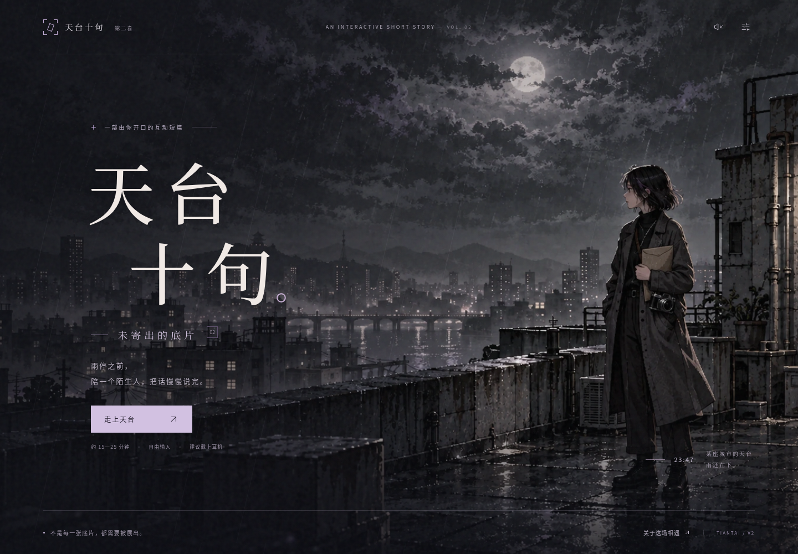
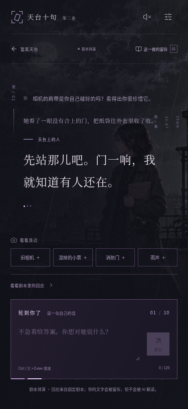

# 未寄出的底片 · 首章交付

这一版将《天台十句》重构为独立的 AI 剧情游戏首章：雨夜、摄影师、被改名的照片，以及十次认真回应的机会。玩家观察现场，用自己的话参与；服务端保存真正说过的话，故事在结尾留下原句的回声。

当前是可运行、可复查的本地候选版本，尚未替换公网 v2。运营版 `tiantaishiju.top` 的代码、服务和数据未改动。

## 实机画面

以下截图来自生产构建与真实 Go 后端的 Chromium 验收，使用明确标识的剧本排演。

## 已完成

- 全新 Vue / TypeScript 前端与独立 Go API；十句、观察、记忆、存档恢复、三个结尾与纪念页导出形成完整流程。
- 真实模型适配器接入对话与结尾生成，基于实际历史回应；模型错误不会消耗次数，重试不会重复写入。无密钥时显式提供作者剧本排演。
- 三张生成美术及两次道具迭代、本地字体、桌面与手机布局；原创配乐《没有关严的门》和动态雨声音景。
- 键盘弹窗、减少动态、字号及独立音量设置；断线重试、多标签页版本冲突与原始输入保留。
- v2 专用部署模板、构建/开发脚本和仅运行隔离测试的 GitHub Actions。

## 验证证据

- `bash v2/scripts/build.sh`：Go race 测试、17 项前端单元测试、ESLint、TypeScript 与生产构建通过。
- `V2_BASE_URL=http://127.0.0.1:4174 npm run test:e2e`：7 项浏览器场景通过，含桌面和手机的完整十句流程、真实持久化与网络故障恢复。
- 构建版封面、设置及游戏界面的 Axe WCAG 2 A/AA、2.1 AA 自动检查为零报告问题。
- 已通过正常 TLS 校验查看现有 `v2.tiantaishiju.top`，用于重构前对照；没有把本地结果当作公网部署结果。

详细范围与限制见 [QA.md](QA.md)。这不代表已完成实际 iOS/Safari 或真实模型的体验验收。

## 继续上线所需

1. 服务器 SSH 主机、用户、端口及安全配置的认证方式；随后只读确认 v2 的工作目录、进程、代理和数据卷与主站分离。
2. v2 专用模型端点、模型名与安全注入的 API Key。代码支持 Chat Completions JSON 对象输出；真实角色表现、延迟与引述准确性仍需实际模型验收。
3. 按 [DEPLOYMENT.md](DEPLOYMENT.md) 在独立候选目录验证，切换 v2 自己的服务，再做公网回归。

不要把私钥、密码或模型密钥放入聊天、Git 仓库或浏览器。当前缺少上述服务器与模型配置，因此没有执行远程部署。

## 入口

- [本地启动说明](../../v2/README.md)
- [叙事与角色设计](NARRATIVE.md)
- [美术来源与原稿](../../v2/art/README.md)
- [配乐说明](AUDIO.md) · [84 秒雨夜混音](../../v2/audio/demo.ogg) · [独立配乐分轨](../../v2/audio/music-only.ogg)
